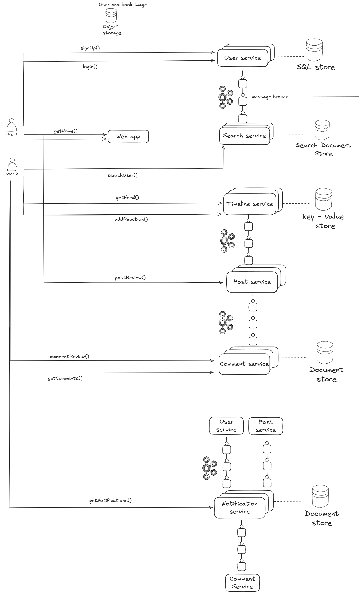
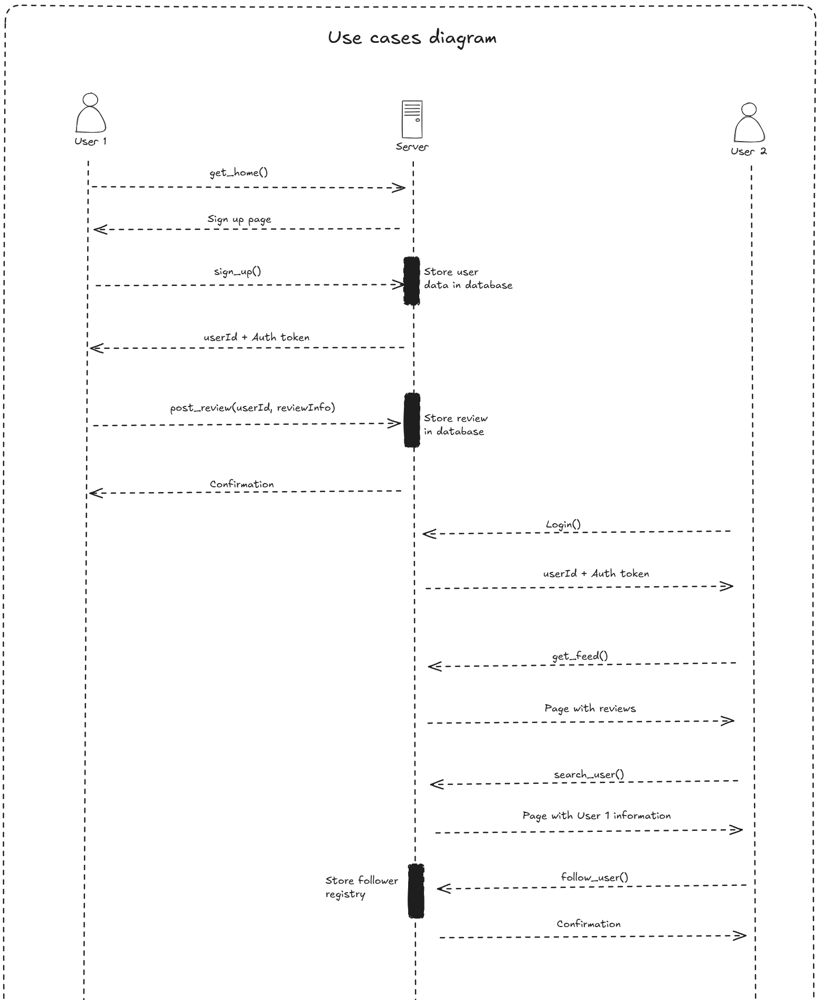

# RateMyBook-BackEnd

RateMyBook is a Spring Boot-based backend application that allows users to rate books and share their reviews. This repository contains the microservices that form the backend architecture of the app.  
RateMyBook is an application where users can rate books, leave reviews, and view ratings from other users. The backend is designed to be scalable and modular, using a microservices architecture based on Spring Boot.

---

## Architecture

The backend architecture is based on microservices, each responsible for a specific area of functionality. Below is an architecture diagram for the backend.

### Architecture Diagram

---

## Use Case Diagram

### Use Case Diagram

---

## Technologies

- **Spring Boot**: For building the backend microservices.
- **JWT**: For handling user authentication securely.
- **Docker**: To containerize the services for easy deployment.

---

### Prerequisites

- Java 21 or higher
- Maven
- Docker (optional for containerization)
